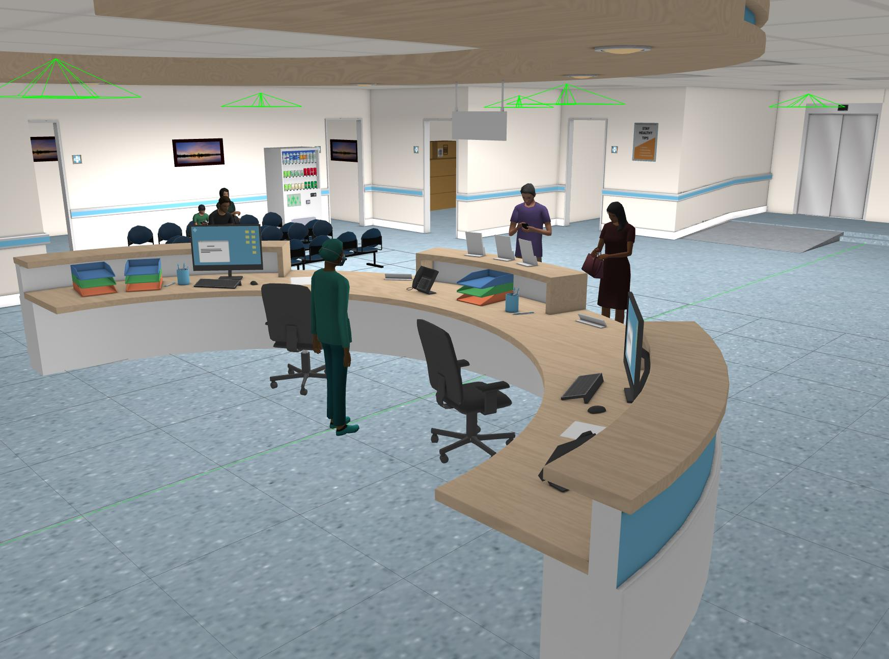
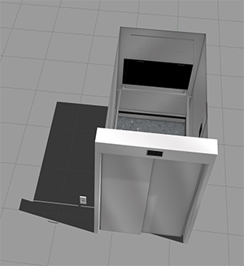
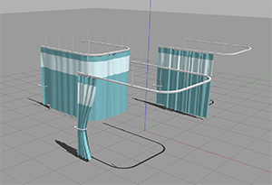
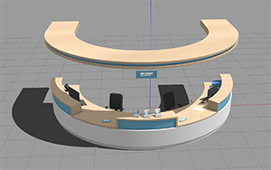
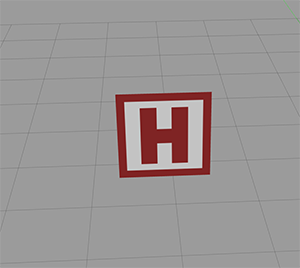
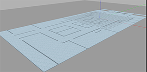
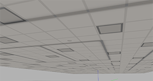

# AWS RoboMaker Hospital World ROS package

**Visit the [AWS RoboMaker website](https://aws.amazon.com/robomaker/) to learn more about building intelligent robotic applications with Amazon Web Services.**



## 3D Models included in this Gazebo World

| Model (/models)       | Picture           |
| :------------- |:-------------:|
| **aws_robomaker_hospital_elevator_01_car, aws_robomaker_hospital_elevator_01_door, aws_robomaker_hospital_elevator_01_portal**     |  |
| **aws_robomaker_hospital_curtain_closed_01, aws_robomaker_hospital_curtain_half_open_01, aws_robomaker_hospital_curtain_open_01**     |  |
| **aws_robomaker_hospital_nursesstation_01**    | 
| **aws_robomaker_hospital_hospitalsign_01**    | 
| **aws_robomaker_hospital_floor_01_floor**    | 
| **aws_robomaker_hospital_floor_01_walls**    | 
| **aws_robomaker_hospital_floor_01_ceiling**    | 

We also reference the following models from https://app.ignitionrobotics.org/fuel/models:

*XRayMachine, IVStand, BloodPressureMonitor, BPCart, BMWCart, CGMClassic, StorageRack, Chair, InstrumentCart1, Scrubs, PatientWheelChair, WhiteChipChair, TrolleyBed, SurgicalTrolley, PotatoChipChair, VisitorKidSit, FemaleVisitorSit, AdjTable, MopCart3, MaleVisitorSit, Drawer, OfficeChairBlack, ElderLadyPatient, ElderMalePatient, InstrumentCart2, MetalCabinet, BedTable, BedsideTable, AnesthesiaMachine, TrolleyBedPatient, Shower, SurgicalTrolleyMed, StorageRackCovered, KitchenSink, Toilet, VendingMachine, ParkingTrolleyMin, PatientFSit, MaleVisitorOnPhone, FemaleVisitor, MalePatientBed, StorageRackCoverOpen, ParkingTrolleyMax*

# Include the world from another package

* Update .rosinstall to clone this repository and run `rosws update`
```
- git: {local-name: src/aws-robomaker-hospital-world, uri: 'https://github.com/aws-robotics/aws-robomaker-hospital-world.git', version: master}
```
* Add the following to your launch file:
```xml
<launch>
  <!-- Launch World -->
  <include file="$(find aws_robomaker_hospital_world)/launch/hospital.launch"/>
  ...
</launch>
```

# Load directly into Gazebo (without ROS)
```bash
chmod +x setup.sh
./setup.sh
export GAZEBO_MODEL_PATH=`pwd`/models:`pwd`/fuel_models
gazebo worlds/hospital.world
```

# ROS Launch with Gazebo viewer (without a robot)
```bash
# build for ROS
rosdep install --from-paths . --ignore-src -r -y
colcon build

# run in ROS
source install/setup.sh
roslaunch aws_robomaker_hospital_world view_hospital.launch
```

# Building
Include this as a .rosinstall dependency in your SampleApplication simulation workspace. `colcon build` will build this repository.

To build it outside an application, note there is no robot workspace. It is a simulation workspace only.

```bash
$ rosws update
$ rosdep install --from-paths . --ignore-src -r -y
$ chmod +x setup.sh
$ ./setup.sh
$ colcon build
```

